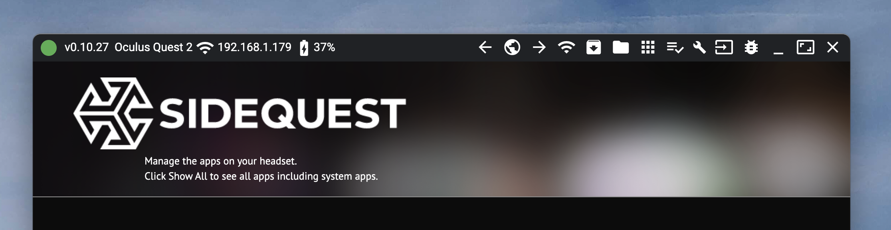
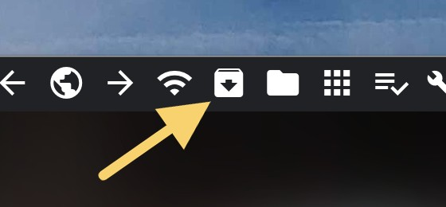
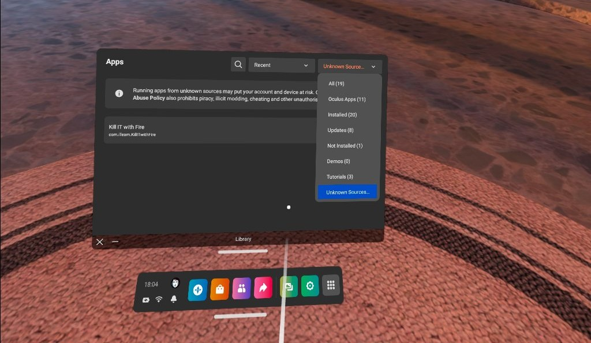

# Kill It With Fire 🔥

A VR game created by Game Jam 2022 team: `iTeam`

- Tim Slow
- Natalia Marek
- Conor Gilbert
- John Wrightson

## Running the game

- Download the [latest release](https://github.com/jcwrightson/game-jam-2022/releases)
- Find your platform located within in the `dist` directory
  - Win: With your headset connected, run the `.exe`
  - Android/Mac/Linux: apk

### Android/Mac/Linux

1. Go to [https://sidequestvr.com/download](https://sidequestvr.com/download) and download Sidequest app for Windows, Mac or Linux (note that mobile app won’t work for this use case!) and install it on your system.
2. In order to upload the game as APK to your headset you will have to [Oculus developer platform](https://developer.oculus.com/manage/organizations/) and create new organization, by entering a name of the organization (unique name) and agreeing to terms).
3. On Windows you will also have to install [additional drivers](https://developer.oculus.com/downloads/package/oculus-go-adb-drivers).
4. Open the Oculus app on your phone, tablet or PC, go to Devices, select Developer moge and toggle it.
5. Next connect your Oculus headset via cable to your Mac, Windows or Linux and Allow USB Debugging (make sure to check Always allow from this computer).
6. Open SideQuest app and you should be able to see green dot in the top left corner indicating that your Oculus device is connected.

7. Next upload apk file by clicking on `Install APK file from a folder on computer`, and selecting `kill-it-with-fire.apk` file from located in `dist/Android` in latest release folder.

8. You should be able to see `kill-it-with-fire.apk` in the Unknown sources apps on your Oculus, double click on it to open and play 🔥 🔥 🔥

## Controls

Use the trigger on your controller to fire the flamethrower or activate the lightsaber
